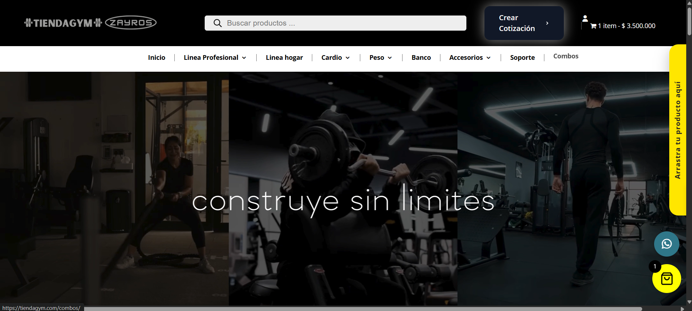
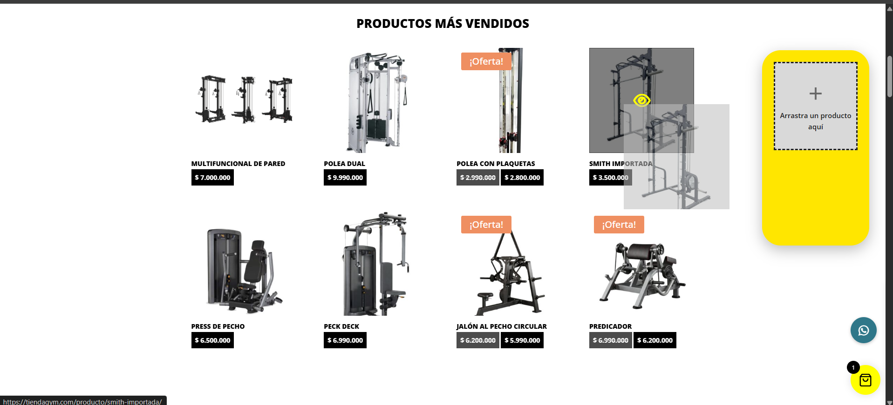
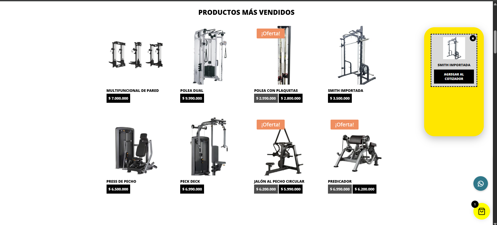
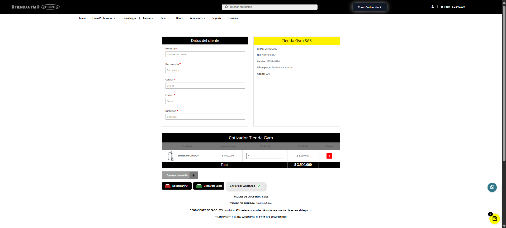
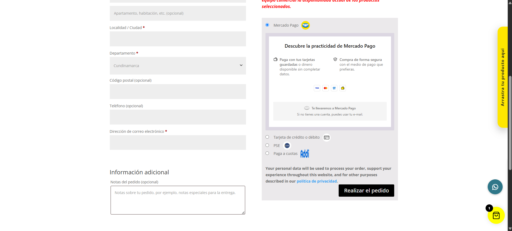
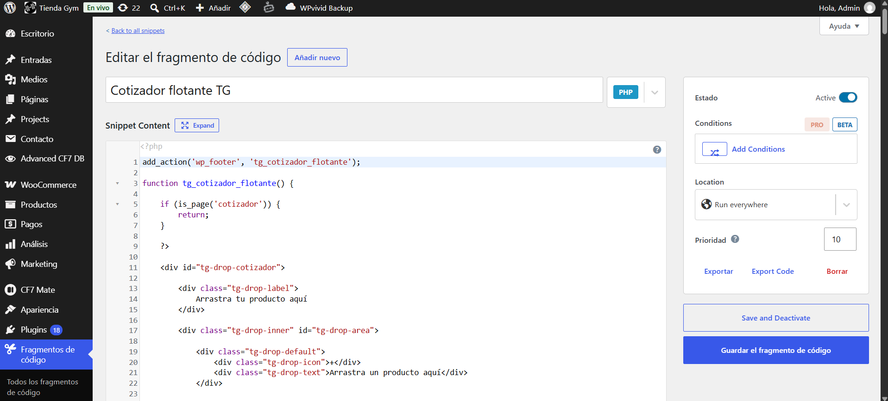

# Tienda Gym — Corporate Website

E-commerce website for Tienda Gym (a gym equipment and accessories store), designed,
developed, and maintained entirely by me with WordPress, Divi, and WooCommerce.

**Live site:** [tiendagym.com](https://tiendagym.com/)

> **Note:** this is not a traditional code repository. The site runs on WordPress
> (Divi + WooCommerce), not on a framework tracked in Git. That's why this repo documents the
> real work done on the site — with screenshots of the result and, in `codigo/`, the actual
> HTML, CSS, PHP, and JavaScript I wrote for the two most important features I built from
> scratch (sanitized of financial/access data only, nothing else).

## What it is

A complete online store for gym equipment (professional line, home line, cardio, weights, and
accessories), with a catalog, cart, checkout, and — the most interesting part — a custom
quoting system that replaced a manual process that was costing the sales team time.

## The problem I solved: quotes that were eating up the sales team's time

Tienda Gym's customers usually order several combined products and custom quotes (equipping an
entire gym, for example), not simple single-product purchases. Before, every one of those
quotes was put together manually by a sales rep: looking up prices, calculating subtotals,
building the document. As volume grew, that started taking up a lot of the sales team's time.

**What I built:** a self-service quoting tool built into the site itself, so the customer puts
together their own quote and the sales rep only has to receive it ready to confirm.

- **Two ways to add products to the quote:**
  - A **drag-and-drop floating widget** that shows up on every catalog page: the customer
    drags any product card onto the panel and it gets saved for the quote (using
    `localStorage`, no account or login required).
  - A **live search** inside the `/cotizador` page, which queries the WooCommerce Store API in
    real time to add products without leaving that page.
- **Technical challenge:** several products are variable (price changes by size, color,
  capacity, etc.), and the WooCommerce Store API doesn't expose per-variation pricing in the
  listing endpoint. I solved this by *scraping* the variations form that WooCommerce already
  injects into each product page's HTML (`data-product_variations`), and showing those options
  in both the floating widget and the search modal before adding the product.
- **Real-time customer data validation:** name letters-only, ID and phone numbers-only (phone
  capped at 10 digits), email restricted to common domains, address required — with
  field-specific error messages and a general message if something's missing (e.g. no
  products added).
- **Three ways to close out the quote:**
  - Download a **PDF** with the company's letterhead and colors (generated in the browser
    with jsPDF, including the logo loaded dynamically).
  - Download an **Excel** file with the same format, with merged cells, corporate colors, and
    the logo embedded (generated with ExcelJS).
  - **Send it over WhatsApp** straight to the sales number, with the message already put
    together (customer, products, quantities, and total).
- **Automatic logging:** every quote generated is also sent, in the background, to a Google
  Apps Script that saves it to a Google Sheet — so the sales team has a record of every quote
  without needing a database of their own.
- Every quote gets a unique sequential number (`TG-YEAR-XXXXXX`), stored in `sessionStorage` so
  the record isn't duplicated if the customer downloads both the PDF and the Excel for the same
  quote.

I built all of this without leaving WordPress: the quoting page's HTML/CSS/JS lives in a Divi
code module, and the floating widget (which needs to show up on *every* page) I injected as a
PHP snippet with the **Code Snippets** plugin, hooked into `wp_footer`. The actual code for
both pieces is in [`codigo/`](codigo/).

## Checkout with multiple payment methods

Besides the quoting tool, I set up WooCommerce checkout with several payment methods: Mercado
Pago, credit/debit card, PSE, and **Addi** (buy-now-pay-later). Integrating Addi surfaced a
contrast bug in WooCommerce's classic checkout — error messages showed up in blue text on a
blue background, unreadable — which I fixed with custom CSS from Divi (Theme Options → General
→ Custom CSS), without touching any theme or plugin files.

## Screenshots

| | |
|---|---|
|  Product catalog |  Drag-and-drop floating widget |
|  Quoting page with customer details |  Checkout with Addi as a payment method |

*The floating widget injected as a PHP/JS/CSS snippet with the WordPress Code Snippets plugin.*

## Tech stack

WordPress · Divi Builder · WooCommerce (Store API) · Code Snippets (custom PHP/JS/CSS) ·
Vanilla JavaScript · jsPDF · ExcelJS · Google Apps Script (Google Sheets logging) · Addi
(buy-now-pay-later gateway)

## Other projects

- [TiendaGymBI](https://github.com/Molaneitor/TiendaGymBI) — sales, costs, and inventory data
  pipeline for the same company, built with Python, SQL Server, and Power BI.
